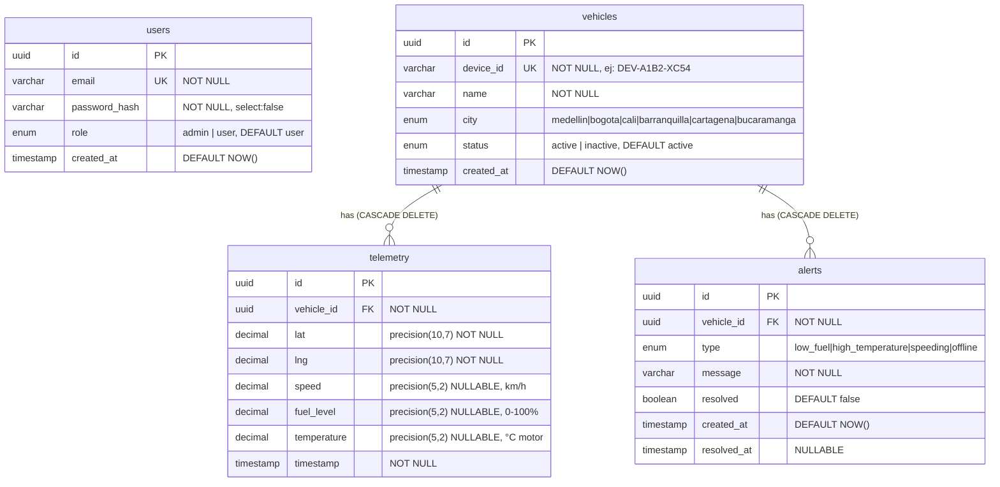

# Simon Movilidad — Entity Relationship Diagram

## Diagrama ER



---

## Relaciones

| Relación | Cardinalidad | Comportamiento |
|----------|-------------|----------------|
| `vehicles` → `telemetry` | 1 a N | `ON DELETE CASCADE` — borrar vehículo elimina todo su historial |
| `vehicles` → `alerts` | 1 a N | `ON DELETE CASCADE` — borrar vehículo elimina todas sus alertas |
| `users` | Aislada | Sin FK hacia otras tablas. Auth por JWT; el rol viaja en el token. |

---

## Enumeraciones

```sql
-- Roles de usuario
ENUM role: 'admin' | 'user'

-- Ciudades operativas
ENUM city: 'medellin' | 'bogota' | 'cali' | 'barranquilla' | 'cartagena' | 'bucaramanga'

-- Estado del vehículo
ENUM status: 'active' | 'inactive'

-- Tipos de alerta
ENUM alert_type: 'low_fuel' | 'high_temperature' | 'speeding' | 'offline'
```

---

## Notas de implementación

- **`password_hash`** tiene `select: false` en TypeORM — nunca se retorna en queries por defecto.
- **`device_id`** se genera automáticamente al crear un vehículo (`DEV-XXXX-YYYY`). Se enmascara a `DEV-****-YYYY` para usuarios con rol `user`.
- **`telemetry.speed`**, **`fuel_level`** y **`temperature`** son nullable para tolerar dispositivos que no reportan todos los campos.
- **`alerts.resolved_at`** es nullable — se llena solo cuando `resolved = true` via `PATCH /alerts/:id/resolve`.
- No existe FK entre `users` y `vehicles`/`telemetry`/`alerts`. La autorización es stateless (JWT).
